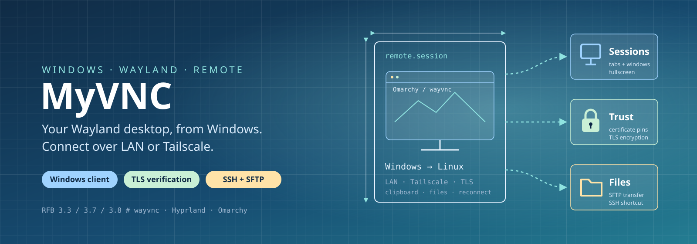
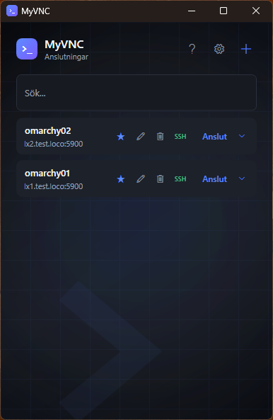
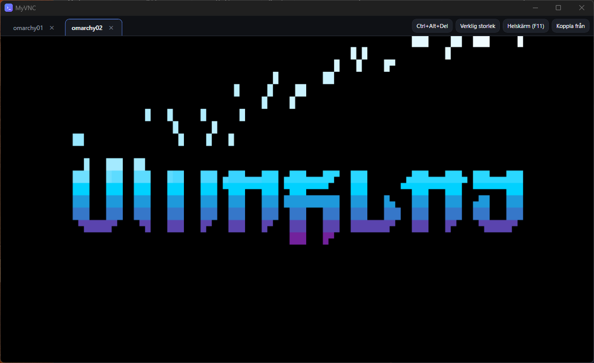
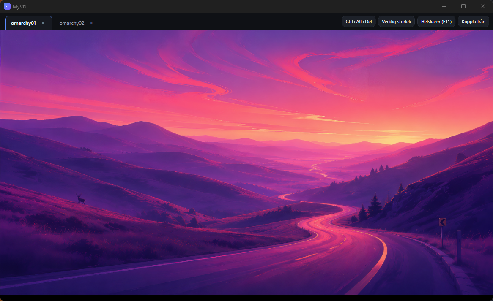

# MyVNC

[](https://github.com/QforA42/MyVNC/actions/workflows/ci.yml) [](LICENSE)

A custom-built VNC client for Windows, made to connect cleanly to [Hyprland](https://hyprland.org/)/[omarchy](https://omarchy.org/) machines running [wayvnc](https://github.com/any1/wayvnc), on the LAN or over Tailscale. Built from scratch (own RFB protocol implementation, no bundled VNC library).



| Tabbed sessions |
|---|
|  |
|  |

> The tab bar/toolbar shown above isn't always on screen — see **"Hold Right Ctrl to reveal the top bar"** below.

## Features

- **Own RFB/VNC client** — version handshake 3.3/3.7/3.8, None/VNC-Auth/VeNCrypt security (covers wayvnc's Plain/TLSPlain/X509Plain, preferring the TLS-encrypted variants), Raw/CopyRect/DesktopSize/ZRLE encodings.
- **Verifies the server before sending your password** — wayvnc uses a self-signed certificate, so MyVNC uses trust on first use: the first connection to an address shows the certificate's SHA-256 fingerprint (and the command that prints it on the server) for you to compare, then pins it in `%APPDATA%\MyVNC\known_hosts.json`. A changed certificate is a warning that defaults to refusing, and a pinned host that suddenly offers no encryption is refused outright. File transfer checks the SSH host key the same way. See [SECURITY.md](SECURITY.md#how-myvnc-verifies-servers).
- **Follows the Windows theme** — light or dark from the Windows app mode, plus the accent color you picked in Personalization → Colors, applied live when either changes. Settings → THEME can pin it to light or dark instead of following Windows.
- **Multi-session** — open new connections as separate windows or as tabs in one window, switchable in Settings.
- **Fullscreen** — F11 toggles it; the window chrome drops and the OS maximize button behaves the same way.
- **Hold Right Ctrl to reveal the top bar** (or triple-tap Left Ctrl to pin it open) — MyVNC's own chrome (tab bar/toolbar) is hidden by default in both windowed and fullscreen mode, so it never covers the remote desktop's own panel. **Hold Right Ctrl and move the pointer to the top edge to reveal it while held**, or **triple-tap Left Ctrl within ~600ms to pin it visible** — handy on keyboards without a comfortable key to hold down, or KVM/remote setups missing one entirely. Triple-tap again to unpin. The full shortcut list is in the in-app Help page.
- **Four addresses per host** — Host IP, FQDN, Tailscale IP, Tailscale FQDN, with a default per host and a one-off picker on every connect.
- **Per-host connection options** — view-only mode, independent clipboard directions (receive/send), actual-size vs. fit-to-window, a test-connection reachability check.
- **Search and pin saved connections** — filter the dashboard list by name/host/address, and pin favorites to the top.
- **Duplicate-connection guard** — only one live session per host at a time, no matter which of its known addresses (Host IP, FQDN, Tailscale IP, Tailscale FQDN) is used to connect; a second attempt focuses the existing session instead of opening a competing one.
- **Auto-reconnect** with exponential backoff after an unexpected drop, capped at 3 attempts before giving up and closing the tab automatically. A handshake followed by an immediate drop counts as a failed attempt, and closing a session window stops its pending reconnects.
- **Wake button** — nudges a DPMS-blanked remote screen (sends a harmless key), and a Ctrl+Alt+Del button for the remote login screen.
- **SSH terminal shortcut** — a per-card icon appears once a host's SSH port is confirmed reachable, launching PowerShell/Windows Terminal/WSL with `ssh` pre-filled. Also doubles as a way to unlock a host that's still sitting at boot: if the machine uses full-disk encryption with `dropbear-initramfs` (or similar) for remote unlock, that listens on the same port 22 well before wayvnc is up — SSH in (with `-i <key>` if it needs a specific identity file) and run your unlock command (e.g. `cryptroot-unlock`) the same way you would from any terminal. Live-tested: MyVNC's auto-reconnect picks the session up automatically the moment wayvnc comes up afterward, no manual reconnect needed.
- **Send/receive files** — a session's toolbar has "Skicka fil…"/"Send file…" (button or drag-and-drop onto the session) and "Hämta fil…"/"Receive file…", both over SFTP (SSH, port 22) into/from a fixed `~/myvnc-shared` folder on the host. RFB/VNC itself has no file-transfer capability, so this is a side-channel, not part of the VNC protocol — it reuses the same username/password already stored for the connection (works automatically when wayvnc's `enable_pam=true`, since that's then the same as the host's Linux login). The host's SSH key is verified before the password is sent, and downloaded file names are checked so they can't land outside the folder you picked.
- **Opt-in debug logging** — off by default, toggle it in Settings. Writes connection lifecycle, security/encoding negotiation, disconnects, and reconnect attempts to `%APPDATA%\MyVNC\myvnc.log`, viewable via the "Open log" button — never credentials, keystrokes, or clipboard contents. A background watchdog also self-monitors memory/CPU and warns (always logged, regardless of the toggle) if the app itself looks like it's misbehaving.
- **Full localization** — Swedish, English, Norwegian, Danish, Finnish, Icelandic.
- **Windows integration** — desktop shortcut, taskbar jump-list (pinned + recent hosts, launches sessions directly), single-instance enforced so a jump-list click joins the already-running window instead of starting a disconnected process.
- **In-app Help** — a keyboard-shortcuts table, the paste-key gotcha (Ctrl+Shift+V, not Ctrl+V), how the client works, wayvnc configuration pointers including three common setups (external monitor, built-in screen, and one client at a time), and known limitations — all available as full pages from the dashboard's About/Help/Settings buttons, alongside New/Edit Connection.

## Installing

Requires Windows 10 or 11 (x64).

**Download the installer:** [MyVNC-Setup-0.10.1.exe](https://github.com/QforA42/MyVNC/releases/download/v0.10.1/MyVNC-Setup-0.10.1.exe) (or browse all [releases](https://github.com/QforA42/MyVNC/releases)) — per-user install, no admin rights or UAC prompt required.

**Build your own installer instead** (needs the [.NET 10 SDK](https://dotnet.microsoft.com/download) and [Inno Setup 6](https://jrsoftware.org/isinfo.php): `winget install --id JRSoftware.InnoSetup -e`):

```powershell
installer\build-installer.ps1
```

This publishes a self-contained Release build and produces `installer\output\MyVNC-Setup-<version>.exe`. See [installer/](installer/).

**From source** (needs the .NET 10 SDK):

```powershell
dotnet build MyVNC.slnx -c Release
```

The exe lands in `src\MyVNC.App\bin\Release\net10.0-windows\MyVNC.App.exe`.

## Configuring the remote host

The dashboard's `?` (Help) button covers this in the app itself, but in short, on the wayvnc side you generally want:

```ini
address=0.0.0.0
port=5900
enable_auth=true
enable_pam=true
certificate_file=~/.config/wayvnc/certificate.pem
private_key_file=~/.config/wayvnc/private_key.pem
```

`enable_pam=true` means you log in with your normal Linux account credentials — exactly what MyVNC sends. Keyboard layout usually follows the system's own layout automatically; only set `xkb_layout` explicitly in wayvnc's config if å/ä/ö or similar keys don't work.

The certificate is what MyVNC verifies on the first connection; to compare the fingerprint it shows, run this on the host:

```sh
openssl x509 -in ~/.config/wayvnc/certificate.pem -noout -fingerprint -sha256
```

If the host is reinstalled or its certificate or SSH keys are regenerated, use **Forget saved host keys** on the connection's edit page, then connect again and compare the new fingerprint.

## Known limitations

Kept in sync with the in-app Help page — only what's actually still true today (see git history/CHANGELOG for the historical postmortem of bugs that were found and fixed along the way, e.g. the click-flyout and "Alt_R" log-spam issues, both MyVNC bugs rather than Wayland/wlroots limitations).

- **A fully suspended remote can't be woken via keyboard/mouse over VNC** — it has no running network stack left to receive input on. A host that's merely screen-locked or DPMS-blanked stays fully reachable, and synthetic input over an already-open RFB connection *can* wake it (see the Wake button above). If a session won't wake, `ping` the host first: reachable-but-unresponsive points at a Hyprland/compositor-side issue (e.g. a stuck idle/lock screen); unreachable means check the machine's suspend configuration (`hypridle`, `systemd-logind`'s `IdleAction`) instead.
- **A connection that comes up and is dropped immediately, over and over,** usually means a half-open session is left in front of a single-client guard on the server (wayvnc itself has no connection cap, so such guards are home-made). Run `wayvncctl client-list` on the remote machine; if it lists a client that isn't you, drop it with `wayvncctl client-disconnect <id>`. The in-app Help shows a guard that disconnects the *older* sessions, which avoids this.

## Development

See [CONTRIBUTING.md](CONTRIBUTING.md) for versioning rules, commit conventions, and the build workflow. Version history lives in [CHANGELOG.md](CHANGELOG.md), with a per-release note (scope, regression testing done, known risks) under [docs/releases/](docs/releases/). Quick reference:

```powershell
dotnet build MyVNC.slnx                      # Debug
dotnet build MyVNC.slnx -c Release            # Release
dotnet test tests\MyVNC.Rfb.Tests             # RFB protocol unit tests
powershell -File scripts\smoke-test.ps1       # process-level regression check
```

## Security

Found a vulnerability? Please report it privately — see [SECURITY.md](SECURITY.md), which also describes how MyVNC verifies servers and its known security limitations.

## License

MyVNC is released under the [MIT License](LICENSE). It uses [SSH.NET](https://github.com/sshnet/SSH.NET) (MIT) for file transfer; see [THIRD-PARTY-NOTICES.txt](THIRD-PARTY-NOTICES.txt) for all bundled components.
